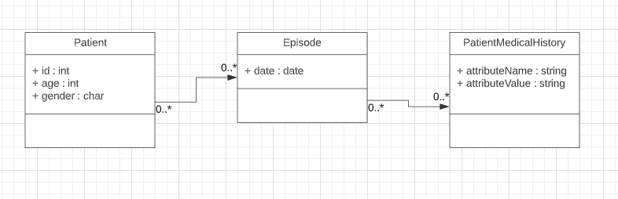
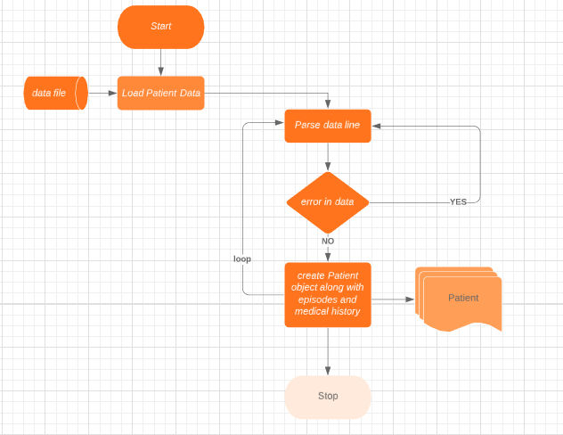

# Solution
* Create a Data model applying Normalization rules from the given data schema
* Construct a DataLoader to map data from input to the Data model.

# Data Model Creation
After Applying Normalization following Data model is generated,

# Program Flow

# Assumption
Data will fit in memory.

